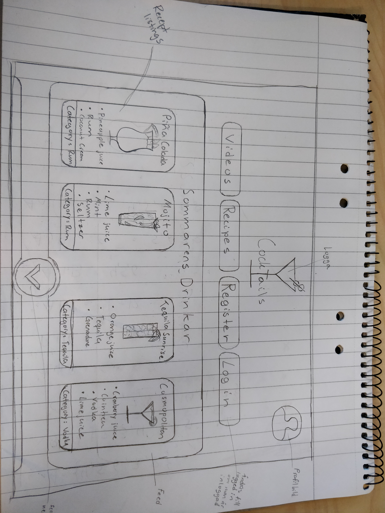

# Projektplan

## 1. Projektbeskrivning (Beskriv vad sidan ska kunna göra)

Tanken är att sidan jag gör ska vara en hemsida likt en receptsamling fast för cocktails/drinkar. Man ska kunna skapa konton att logga in med, lägga upp recept på drinkar och spara sina favoriter i en lista. Dessutom ska det gå att söka på olika cocktails utifrån kategorier och dessa är indelade efter spritsort den är baserad på. Exempelvis skulle en kategori kunna vara "Rom-drinkar" eller "Gin-drinkar".
Tanken är att ha många-till-många-relation mellan mina recept och ingredienser.

## 2. Vyer (visa bildskisser på dina sidor)

## 3. Databas med ER-diagram (Bild)

## 4. Arkitektur (Beskriv filer och mappar - vad gör/inehåller de?)
